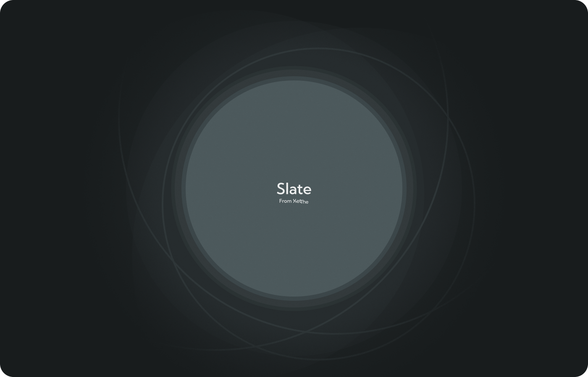

# Slate
An open source osu! skin template designed to make skinning easy.

## About Slate.
The name comes from the phrase "A clean slate" which means, well, a blank canvas, so to say.

Ever since I started making skin in osu! I found out how hard it was to get some things right <small style="font-size: 8px">looking at you mania</small>. That's why, one day I decided to start compiling a list of ALL (or at least most) of the gimmicks about osu! skinning and turn it all upside down to end up with:

- A template osu! skin that makes sense and "just works".
- A highly accurate preview of the final skin directy in Photoshop.
- A way to export the skin directly to the game in as less time as possible.

And Slate is all that!... Or that's the end goal of it.

Slate is currently in a development state, which means most of these features don't work as intended, or just don't work at all!

But an effort is being made to push this project to every aspiring osu! skinner so their life is a bit less painful :)

## Contribute to Slate.

As of now, everyone can help contribute to the Slate project by suggesting features, or reporting bugs, I want to make sure this template is as flawless as possible, it's for everyone to use after all!

## License.

Slate is Licensed under the CC-BY-4.0 license. for more information on this license and what it allows, you can [Go Here]()